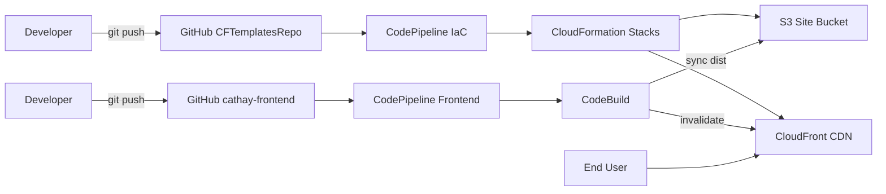

# CFTemplatesRepo — Cafe Infra (CloudFormation + CI/CD)

用 **AWS CloudFormation** 定義並部署本專案的雲端基礎設施，包含：
- `cafe-network.yaml`：VPC、公有子網（供應用/EC2 使用）
- `cafe-app.yaml`：示範動態站台（EC2 + SG + UserData）
- `frontend-stack.yaml`：前端靜態架構（S3 + CloudFront），並把關鍵輸出寫入 **SSM Parameter Store**
- （此 repo 也可搭配 CodePipeline/CodeBuild 自動部署）

> 預設區域：**ap-northeast-1 (Tokyo)**  
> 建議在 **AWS CloudShell** 執行以下指令（內建 AWS CLI）。

---

## 目錄結構
```
templates/
├─ cafe-network.yaml # VPC / 公有子網（輸出 SubnetID / VpcID 並 Export）
├─ cafe-app.yaml # EC2 + SG（UserData 安裝 Apache/MariaDB/PHP）
└─ frontend-stack.yaml # S3 + CloudFront + SSM 參數（/cafe/frontend/*）
```
---

## 快速開始（CloudShell）

```bash
# 共用變數
ACCOUNT_ID=$(aws sts get-caller-identity --query Account --output text)
REGION=ap-northeast-1
REPO_ROOT=~/environment/CFTemplatesRepo

# 1) 部署網路層
aws cloudformation deploy \
  --stack-name cafe-network \
  --template-file $REPO_ROOT/templates/cafe-network.yaml \
  --capabilities CAPABILITY_NAMED_IAM

# 2) 部署應用層（EC2）
aws cloudformation deploy \
  --stack-name cafe-app \
  --template-file $REPO_ROOT/templates/cafe-app.yaml \
  --capabilities CAPABILITY_NAMED_IAM

# 3) 部署前端基礎設施（S3 + CloudFront）
SITE_BUCKET="cafe-frontend-${ACCOUNT_ID}-${REGION}"
aws cloudformation deploy \
  --stack-name the-cafe-frontend \
  --template-file $REPO_ROOT/templates/frontend-stack.yaml \
  --parameter-overrides SiteBucketName=${SITE_BUCKET} \
  --capabilities CAPABILITY_NAMED_IAM
```

部署完成後會有：
* SSM 參數：
  * /cafe/frontend/bucket：網站 S3 桶名（例如 cafe-frontend-<acct>-ap-northeast-1）
  * /cafe/frontend/distribution：CloudFront Distribution ID
* CloudFormation 輸出（在 the-cafe-frontend 堆疊的 Outputs 可看到 CloudFront 網域）

---

# 前端 CI/CD（與 cathay-frontend repo 串接）
## 建議流程
1. 在 CodePipeline 建一個 pipeline（Source=GitHub，Build=CodeBuild）。
  * Source：GitHub（指向 cathay-frontend 的 main 分支）
  * Build：CodeBuild（Source from CodePipeline）
2. CodeBuild 專案 Source 選 CodePipeline，在前端 repo 放置 buildspec.yml（見該 repo）。
3. 給 CodeBuild 服務角色 最小權限（下方 JSON）
> Artifacts Bucket 名稱可從該 Pipeline 第一次建立時自動產生的 S3 桶取得。
```
{
  "Version": "2012-10-17",
  "Statement": [
    {
      "Sid": "ReadArtifactsBucket",
      "Effect": "Allow",
      "Action": ["s3:GetObject","s3:GetObjectVersion","s3:ListBucket"],
      "Resource": [
        "arn:aws:s3:::<YOUR-ARTIFACTS-BUCKET>",
        "arn:aws:s3:::<YOUR-ARTIFACTS-BUCKET>/*"
      ]
    },
    {
      "Sid": "PublishToSiteBucket",
      "Effect": "Allow",
      "Action": ["s3:ListBucket","s3:GetBucketLocation"],
      "Resource": "arn:aws:s3:::cafe-frontend-<ACCOUNT_ID>-ap-northeast-1"
    },
    {
      "Sid": "WriteObjectsToSiteBucket",
      "Effect": "Allow",
      "Action": ["s3:PutObject","s3:DeleteObject","s3:PutObjectTagging","s3:DeleteObjectTagging"],
      "Resource": "arn:aws:s3:::cafe-frontend-<ACCOUNT_ID>-ap-northeast-1/*"
    },
    {
      "Sid": "InvalidateCloudFront",
      "Effect": "Allow",
      "Action": ["cloudfront:CreateInvalidation","cloudfront:GetInvalidation","cloudfront:ListInvalidations"],
      "Resource": "arn:aws:cloudfront::<ACCOUNT_ID>:distribution/<DISTRIBUTION_ID>"
    },
    {
      "Sid": "ReadSSMParameters",
      "Effect": "Allow",
      "Action": ["ssm:GetParameter","ssm:GetParameters","ssm:DescribeParameters"],
      "Resource": [
        "arn:aws:ssm:ap-northeast-1:<ACCOUNT_ID>:parameter/cafe/frontend/bucket",
        "arn:aws:ssm:ap-northeast-1:<ACCOUNT_ID>:parameter/cafe/frontend/distribution"
      ]
    }
  ]
}

```
> 先求快也可暫用 AmazonSSMReadOnlyAccess，之後再收斂到上面最小集。
---

**架構圖**

---
## 清理
1. 清空前端 S3 桶 → 刪除 the-cafe-frontend 堆疊
2. 刪除 cafe-app → 刪除 cafe-network（若有 Export 依賴需先移除）
3. 刪除 SSM 參數 /cafe/frontend/*
4. 若有自訂網域或 ACM 憑證，先在 CloudFront 解除綁定再刪
---
## 相關連結
* Frontend（React）：https://github.com/fanfan0412/cathay-frontend
